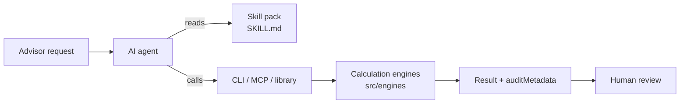

# wealth-skills

**AI skills for US wealth management.** wealth-skills gives AI agents such as Claude Code, Codex and Cursor the workflow knowledge and calculation tools to help advisors with financial planning, portfolios, trading, client onboarding, compliance, CRM, research and family-office work, with guardrails built in for a regulated industry.

It has three parts that work together:

- **Skill packs** (`skills/*/SKILL.md`) tell an agent when a pack applies, which calculations it can run, which topics are guidance only, and which limits it must state to the user.
- **Calculation engines** (`src/engines/`) do the math: tax bracket headroom, RMDs, rebalancing, Value at Risk, tax-loss harvesting, backtests, order payloads and more. They have no dependencies and run offline.
- **Interfaces** connect agents to the engines: a CLI, two MCP servers, a JavaScript library import, and a browser dashboard for people.

> [!IMPORTANT]
> **v0.1.0 — not production software.** wealth-skills prepares analysis and payloads for a licensed professional to review. It does not connect to custodians, brokers, CRMs or regulatory registries, and it never submits orders or moves money.

## How it works



### Example: sizing a Roth conversion

An advisor asks their agent how much a married couple with $210,000 of adjusted gross income could convert to a Roth IRA this year without leaving the 22% bracket.

1. The request matches the `wealth-planning` skill description, so the agent loads that pack.
2. The pack points the agent to the bracket-headroom engine:

   ```bash
   node bin/wealth-skills.js planning tax-headroom --agi 210000 --status MFJ
   ```

3. The engine returns the calculation with an audit block (abridged):

   ```json
   {
     "taxYear": 2026,
     "standardDeduction": 32200,
     "taxableIncome": 177800,
     "currentBracketRate": "22.0%",
     "currentBracketCeiling": 211400,
     "headroomForRothConversion": 33600,
     "auditMetadata": {
       "skill_pack": "wealth-planning",
       "engine_function": "calculateTaxBracketHeadroom",
       "requires_human_approval": false
     }
   }
   ```

4. The agent answers "about $33,600" and, as the pack requires, says what that figure leaves out: itemized deductions, credits, capital gains and state tax.

## The skill packs

| Pack | What agents can calculate | Guidance only |
|---|---|---|
| [`wealth-planning`](skills/wealth-planning/SKILL.md) | Roth conversion bracket headroom (tax year 2026), required minimum distributions, retirement Monte Carlo with inflation-adjusted withdrawals | Tax-return parsing, estate planning, budgeting, insurance and Social Security |
| [`wealth-portfolio`](skills/wealth-portfolio/SKILL.md) | Drift monitoring and rebalance trades, Value at Risk and expected shortfall, tax-loss harvesting screens, backtests and forward simulations, asset-class exposure | Portfolio accounting and attribution, risk models, optimization, direct indexing |
| [`wealth-execution`](skills/wealth-execution/SKILL.md) | Pre-trade checks (buying power, overselling, short-term gains), Alpaca and Interactive Brokers order payloads, FIX 4.4 orders | Custodian workflows, order routing, allocations, ACAT transfers |
| [`wealth-onboarding`](skills/wealth-onboarding/SKILL.md) | Customer Identification Program field checks, recording an OFAC screen result, onboarding milestone tracking | Sanctions screening, identity verification, KYC documents, account aggregation, e-signatures |
| [`wealth-compliance`](skills/wealth-compliance/SKILL.md) | Screening communications for promissory language and missing disclosures | Registration research on BrokerCheck and IAPD, surveillance archives, supervisory review |
| [`wealth-crm`](skills/wealth-crm/SKILL.md) | Pulling decisions and action items from meeting transcripts, CRM task payloads | Meeting briefing packs, syncing with a CRM |
| [`wealth-research`](skills/wealth-research/SKILL.md) | Valuation ratios from supplied financials, risk-factor keyword summaries, latest FRED series values, SEC EDGAR company facts | Earnings summaries, market news, macro trend analysis |
| [`wealth-uhnw`](skills/wealth-uhnw/SKILL.md) | Collars on concentrated stock with constructive-sale review, private equity multiples (TVPI, DPI, RVPI) | Exchange funds, IRR and J-curve modelling, trusts, philanthropy |

Each `SKILL.md` lists its engine functions, CLI commands and the limits an agent must state.

## Built-in guardrails

- **Nothing executes.** Trading tools build order payloads locally. Submitting them is a decision for a person, in their own systems.
- **Human approval is flagged.** Rebalances, harvesting opportunities, trade payloads and collars return `requiresHumanApproval: true`.
- **Every result is traceable.** CLI and MCP results carry `auditMetadata` naming the engine, method, data used, library version and time.
- **Missing data fails closed.** An applicant with no OFAC result fails CIP, a sell without a known position fails pre-trade checks, and an unknown ticker is rejected. The engines never guess.
- **Gaps are labelled.** Packs mark guidance-only topics, the demo registration lookup declares itself sample data, and a failed live lookup returns `null` rather than a substitute value.

See [docs/COMPLIANCE_GUIDELINES.md](docs/COMPLIANCE_GUIDELINES.md) for the rules agents must follow.

## Getting started

wealth-skills needs Node.js 20.11 or later and has nothing to install.

```bash
git clone https://github.com/ai-theories/wealth-skills.git
cd wealth-skills
npm test
node bin/wealth-skills.js help
```

### CLI

Every command prints JSON with an `auditMetadata` block. Invalid input exits with status 2 (usage) or 1 (engine error). If you leave out a command's input flags, it runs on built-in sample data and says so on stderr.

```bash
node bin/wealth-skills.js portfolio drift-monitor --current '{"equity":68,"fixedIncome":32}' --target '{"equity":60,"fixedIncome":40}' --value 1000000 --band 5
node bin/wealth-skills.js portfolio tlh --lots '[{"id":"L1","symbol":"VOO","quantity":100,"purchasePrice":500,"currentPrice":420,"purchaseDate":"2025-02-03"}]'
node bin/wealth-skills.js uhnw collar --symbol AAPL --shares 100000 --price 215 --basis 25
node bin/wealth-skills.js execution fix-payload --symbol VTI --side BUY --qty 500 --price 275.50
```

### Library

```javascript
import { calculatePortfolioVar } from './src/index.js';

const risk = calculatePortfolioVar(5000000, 0.16, 0.99, 1);
console.log(risk.valueAtRiskDollar, risk.conditionalVaR_ExpectedShortfallDollar);
```

### MCP servers

Register the calculation server with your MCP client, using the absolute path to your clone:

```json
{
  "mcpServers": {
    "wealth-skills": {
      "command": "node",
      "args": ["/absolute/path/to/wealth-skills/mcp-servers/universal-wealth-server/index.js"]
    }
  }
}
```

It provides `backtest_portfolio`, `forward_test_simulation`, `monitor_portfolio_drift`, `calculate_portfolio_var`, `calculate_tax_headroom` and `scan_finra_compliance`.

A second server, `finra-sec-lookup`, answers only from two fictitious records and exists for demos. Don't give it to an agent that could mistake it for BrokerCheck or IAPD. Setup for other platforms is in [docs/AGENT_INTEGRATION.md](docs/AGENT_INTEGRATION.md).

### Dashboard

```bash
npm run dashboard
```

Then open http://127.0.0.1:4173/ to try the planning, portfolio, backtest, collar and FIX calculators in a browser. They run the same engines as the CLI.

## What it does not do

- Connect to custodians, brokers, CRMs, identity providers, or FINRA and SEC registries. Its only live data lookups are FRED series and SEC EDGAR company facts.
- Price options, run a factor risk model, parse tax returns or screen sanctions lists.
- Backtest anything beyond four ETFs (VTI, BND, VXUS and VNQ) over annual returns for 2015–2024. Forward simulations use illustrative assumptions that you can override.
- Handle tax situations beyond 2026 federal ordinary-income brackets for married-filing-jointly and single filers taking the standard deduction.
- Check the wash-sale window after a sale or in other accounts. It looks back 30 days across the lots you supply.

## Repository layout

| Path | Contents |
|---|---|
| `skills/` | The eight skill packs |
| `src/engines/` | Calculation engines, re-exported from `src/index.js` |
| `bin/wealth-skills.js` | Command-line interface |
| `mcp-servers/` | The two MCP servers and their shared protocol layer |
| `dashboard.html` | Browser dashboard, served by `bin/serve-dashboard.js` |
| `tests/` | Test suite |
| `docs/` | Integration, compliance and formatting guides |

## Testing

| Command | What it runs |
|---|---|
| `npm test` | The full offline test suite |
| `npm run test:live` | Live FRED lookups; set `SEC_EDGAR_USER_AGENT` to your organization and contact email to include SEC EDGAR |
| `npm run proofs` | 21 documented use cases with their checks, written to [docs/EMPIRICAL_TEST_PROOFS.md](docs/EMPIRICAL_TEST_PROOFS.md) |

## Documentation

- [docs/AGENT_INTEGRATION.md](docs/AGENT_INTEGRATION.md): setting up Claude, Codex and Antigravity
- [docs/COMPLIANCE_GUIDELINES.md](docs/COMPLIANCE_GUIDELINES.md): human approval, audit trail and client disclaimer rules
- [docs/UI_TEMPLATES.md](docs/UI_TEMPLATES.md): formatting results for each agent platform
- [AGENTS.md](AGENTS.md): agent roles and tool routing
- [CATALOG_CROSSWALK.md](CATALOG_CROSSWALK.md): how the packs map to the wealth management capability catalog

## License

MIT, as declared in `package.json`.
