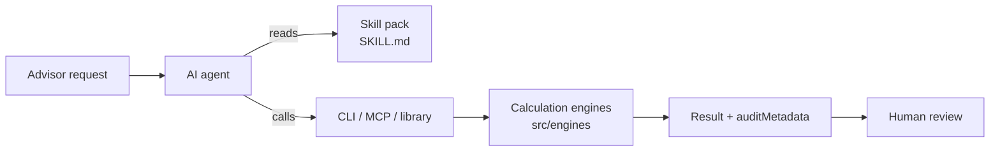

# wealth-skills

**Claude skills and AI agent skills for US wealth management and investing.** wealth-skills is an open-source set of wealth skills and investing skills that gives Claude, Claude Code, Codex, Cursor and other AI agents the workflow knowledge and calculation tools to help advisors with financial planning, portfolios, trading, client onboarding, compliance, CRM, research and family-office work, with guardrails built in for a regulated industry.

It has three parts that work together:

- **Skill packs** (`skills/*/SKILL.md`) tell an agent when a pack applies, which calculations it can run, which topics are guidance only, and which limits it must state to the user.
- **Calculation engines** (`src/engines/`) do the math: tax bracket headroom, RMDs, rebalancing, Value at Risk, tax-loss harvesting, backtests, order payloads and more. They have no dependencies and run offline.
- **Interfaces** connect agents to the engines: a CLI, two MCP servers exposing every CLI capability, a JavaScript library import, and a browser dashboard for people.

> [!IMPORTANT]
> **v0.1.0 — not production software.** wealth-skills prepares analysis and payloads for a licensed professional to review. It does not connect to custodians, brokers or CRMs, it reads regulatory data only from files the SEC publishes for download, and it never submits orders or moves money.

## How it works



Worked examples, from one-command answers to whole engagements, are in [Journeys](#journeys) below.

## Talking to it

The engines answer questions, but a conversation needs two more things: knowing what to ask when something is missing, and knowing what to do next. Every CLI and MCP result carries both.

```jsonc
{
  "cipPassed": false,
  "needsInput": [
    {
      "field": "ofacStatus",
      "question": "Has an OFAC/SDN screen been run for this applicant, and what was the result?",
      "why": "CIP cannot pass without a result from a real screening source."
    }
  ],
  "suggestedNextSteps": [
    { "tool": null, "action": "Collect the missing items above, then re-run the check", "why": "The application is not yet complete." }
  ]
}
```

So an agent asks the advisor instead of inventing a screening result, and offers the next move ("rebalancing will realize gains, scan for harvestable losses first") instead of waiting to be asked. Errors carry `needsInput` too, which turns a refusal to guess into a question: an Interactive Brokers order without a `conid` comes back asking for one.

`node bin/wealth-skills.js capabilities` lists every tool with its summary, required inputs and the phrasings it answers, so an agent can route a request without reading all nine packs.

## Journeys

These are the conversations wealth-skills is built for, told from the advisor's side of the desk. Each one shows what was asked, the command the agent ran, what came back in plain terms, what the agent said next, and where a person makes the call. Every figure is real output from the command shown, and simulations take `--seed` so they reproduce. Client names are fictional.

| Tier | Count | What it feels like |
|---|---|---|
| **Simple** | 10 | A quick question between meetings, answered in one step |
| **Medium** | 12 | A real planning or compliance question, where the agent comes back with a follow-up before the answer is complete |
| **Complex** | 4 | A whole engagement across several packs, ending with the right people signing off |

Click a journey to open it.

---

### Simple

<details>
<summary><b>"How much could this portfolio lose on a bad day?"</b> A $5M household just watched the market drop 2% and wants a number.</summary>

<br>

The advisor knows the portfolio runs at about 16% annual volatility and wants the answer at a demanding 99% confidence.

```bash
node bin/wealth-skills.js portfolio var --value 5000000 --vol 0.16 --confidence 0.99
```

**What comes back.** On 99 trading days out of 100, a single day's loss should stay under **$117,237**, about 2.34% of the portfolio. On the one day in a hundred that is worse, the average loss is **$134,314**. Risk reads as normal for a portfolio this size.

**What the agent adds.** "This estimate assumes returns follow a normal distribution. Real crises produce bigger days than that, so present it as a typical bad day, not a worst case."

</details>

<details>
<summary><b>"What did a plain 60/40 actually do over the last decade?"</b> A prospect wants to know whether a simple portfolio was good enough.</summary>

<br>

```bash
node bin/wealth-skills.js quant backtest --weights '{"VTI":0.6,"BND":0.4}'
```

**What comes back.** $100,000 in a 60% US stock and 40% bond mix at the start of 2015, rebalanced each year, grew to **$219,579** by the end of 2024.

| Measure | Result |
|---|---|
| Annual growth | 8.18% |
| Volatility | 11.9% |
| Worst year (2022) | -16.9% |
| Sharpe ratio | 0.49 |

**What the agent adds.** It offers to project the same mix forward under different economic conditions (Medium journey 5), and points out that year-end figures smooth over drops inside a year, such as March 2020.

</details>

<details>
<summary><b>"How is this private equity fund tracking?"</b> A family office committed $5M to a buyout fund three years ago.</summary>

<br>

```bash
node bin/wealth-skills.js uhnw pe-metrics --commitment 5000000 --called 3000000 --distributions 1200000 --nav 3200000
```

**What comes back.** The fund has called $3M. It has sent back $1.2M in cash and holds $3.2M of value on paper.

- **1.47x TVPI.** Every dollar paid in is worth about $1.47 today.
- **0.4x DPI.** Only 40 cents of each dollar has come back as cash.
- **$2,000,000** of the commitment has not been called yet.

**What the agent adds.** "Keep $2M of liquidity available for capital calls, which come on the fund's schedule, not the family's. Also confirm the date of the NAV, because multiples move with it."

</details>

<details>
<summary><b>"What is Apple trading at on these numbers?"</b> A client asks whether a stock they hold is expensive.</summary>

<br>

```bash
node bin/wealth-skills.js research tear-sheet --ticker AAPL --financials '{"marketCap":3.25e12,"price":215,"eps":7.3,"revenue":3.8e11,"netIncome":1e11,"freeCashFlow":1.08e11,"dividends":1.18}'
```

**What comes back.** At $215 a share the market pays **29.45 times earnings** and **8.55 times sales**. The dividend yields 0.55%. Free cash flow is 108% of net income, so the company turns reported profit into slightly more cash.

**What the agent adds.** "These ratios are only as current as the fundamentals you gave me. If any of this goes into a client note, I'll screen the wording first."

</details>

<details>
<summary><b>"What is it worth on a DCF?"</b> An analyst wants an intrinsic value to set against the market price.</summary>

<br>

Five years of projected free cash flow ($108M rising to $138M), an 8.5% discount rate, 2.5% long-term growth, $50M of net cash and 15.2M shares.

```bash
node bin/wealth-skills.js research dcf --cash-flows '[108,116,124,131,138]' --discount 0.085 --growth 0.025 --net-debt -50 --shares 15.2
```

**What comes back.** An enterprise value of $2,049M, and **$138.11 a share** once the net cash is added.

**What the agent adds.** "About 76% of that value comes from the years after the forecast, so the answer depends heavily on the growth and discount assumptions." It includes the grid to prove it: moving the discount rate by one point, or long-term growth by half a point, puts the value anywhere from about $112.55 to $180.60 a share. It suggests showing the range rather than a single number.

</details>

<details>
<summary><b>"Turn these meeting notes into follow-ups."</b> The advisor walks out of a review meeting with three lines of notes.</summary>

<br>

```bash
node bin/wealth-skills.js crm parse-transcript --text "Client agreed to move to the 60/40 model.
Advisor will send the proposal next week.
Operations will open the trust account."
```

**What comes back.**

- **Decision:** the client agreed to move to the 60/40 model.
- **To do, within 7 days:** the advisor sends the proposal.
- **To do, within 3 days:** operations opens the trust account.

**What the agent adds.** "Give these a quick read against your notes before I create the tasks. Anything phrased unusually may have been missed."

</details>

<details>
<summary><b>"Is this adviser registered?"</b> A client is thinking about moving money to a firm called Ridge Capital.</summary>

<br>

The advisor downloads today's SEC investment adviser file from [adviserinfo.sec.gov/compilation](https://adviserinfo.sec.gov/compilation) and asks the agent to search it. The example uses the fictitious records bundled for testing, which follow the SEC's real format.

```bash
node bin/wealth-skills.js compliance lookup --feed tests/fixtures/iapd/sec-firms.xml --name "ridge capital" --as-of 2026-09-13
```

**What comes back.** One match: **Sample Ridge Capital & Co**, CRD 900002, based in San Francisco.

- It is an **exempt reporting adviser**. It files reports with the SEC but is not registered, which matters if the client expected a registered investment adviser.
- Its Form ADV answers report **disclosures**: SEC or CFTC regulatory actions, and an action by a self-regulatory organization.
- The file is from today, so the status is current.

**What the agent adds.** "Before the client goes further, open the firm's IAPD page to read what those disclosures are, and loop in compliance. If anyone at the firm also sells as a broker, check them on BrokerCheck too. I can't search that site for you."

</details>

<details>
<summary><b>"When does Wednesday's trade settle?"</b> A client needs cash from a sale the day before Thanksgiving.</summary>

<br>

```bash
node bin/wealth-skills.js execution settlement-date --trade-date 2026-11-25 --holidays '["2026-11-26"]'
```

**What comes back.** **Friday, November 27.** US equity trades settle one business day after the trade (T+1, SEC Rule 15c6-1), and Thanksgiving doesn't count as a business day.

**What the agent adds.** "The client can plan on the cash Friday. If the sale is a new issue or a foreign security, confirm its settlement cycle, because a few instruments settle on a different schedule."

</details>

<details>
<summary><b>"Is this ISIN right?"</b> An identifier typed from a PDF statement is about to go on a transfer form.</summary>

<br>

```bash
node bin/wealth-skills.js execution identifier --id US0378331006
```

**What comes back.** It is shaped like an ISIN, but **the check digit is wrong**, which almost always means a typo. The correct code for that security ends in 5: `US0378331005`.

**What the agent adds.** "Please take the identifier from the original document again before it goes on the form. A wrong digit here means a rejected transfer."

</details>

<details>
<summary><b>"Do they owe the 3.8% tax?"</b> A retired couple had a big year of dividends and gains.</summary>

<br>

Modified AGI of $320,000, of which $95,000 is investment income, filing jointly.

```bash
node bin/wealth-skills.js planning niit --magi 320000 --nii 95000 --status MFJ
```

**What comes back.** **$2,660** of net investment income tax. The tax applies to the smaller of two amounts: their $95,000 of investment income, or the $70,000 by which their income exceeds the $250,000 threshold for joint filers. Here that's $70,000, taxed at 3.8%. The threshold has been $250,000 since the tax began in 2013; it is not adjusted for inflation.

**What the agent adds.** "Harvested losses reduce investment income, so a loss harvest before year-end could cut this. Want me to look? Also check that none of this income is from a business they actively run, because that isn't investment income."

</details>

---

### Medium

<details>
<summary><b>1. "How much can they convert to a Roth this year?"</b> A 75-year-old client, married, $210,000 of income.</summary>

<br>

**The situation.** The client wants to move money from a traditional IRA to a Roth without spilling into the 24% bracket.

```bash
node bin/wealth-skills.js planning tax-headroom --agi 210000 --status MFJ
```

**First answer.** After the $32,200 standard deduction their taxable income is $177,800, inside the 22% bracket. The bracket ends at $211,400, leaving **$33,600 of room**.

**The agent's follow-up.** "They're 75, so a required minimum distribution has to come out first, and it uses up the same room. What was the IRA balance last December 31?" The advisor says $500,000.

```bash
node bin/wealth-skills.js planning rmd --age 75 --balance 500000
```

**The full picture.** The required distribution is **$20,325** (the balance divided by 24.6, or about $1,694 a month). If that isn't already counted in the $210,000, the real conversion room is about **$13,275**.

**Who decides.** The advisor presents a range, from $13,275 if the RMD is still to come to $33,600 if it's already in income. The tax preparer confirms state tax and the Medicare premium (IRMAA) effect before anything moves.

</details>

<details>
<summary><b>2. "They're eight points overweight equities. Rebalance them."</b> A $1M portfolio after a strong year for stocks.</summary>

<br>

**The situation.** The target is 60% stocks and 40% bonds. The market has pushed it to 68/32.

```bash
node bin/wealth-skills.js portfolio drift-monitor --current '{"equity":68,"fixedIncome":32}' --target '{"equity":60,"fixedIncome":40}' --value 1000000 --band 5
```

**First answer.** Both sleeves are outside the 5-point band, with an urgency of 80 out of 100. The fix is to **sell $80,000 of stocks and buy $80,000 of bonds**.

**The agent's follow-up.** "Selling stocks after a good run will realize gains. Before trading, let's look for losses in the taxable account to offset them." Only one lot is down, 100 shares of VOO bought at $500:

```bash
node bin/wealth-skills.js portfolio tlh --lots '[{"id":"L1","symbol":"VOO","quantity":100,"purchasePrice":500,"currentPrice":420,"purchaseDate":"2025-02-03"}]'
```

**The tax angle.** Selling that lot realizes an **$8,000 loss** to offset the rebalancing gains. To stay invested, the agent suggests **VV** as a temporary replacement. It tracks a different index (CRSP US Large Cap rather than the S&P 500), which keeps the sale clear of the wash-sale rule.

Then the agent checks the trade against the account and builds the order:

```bash
node bin/wealth-skills.js execution validate --order '{"symbol":"VOO","action":"SELL","quantity":100,"price":420}' --positions '{"VOO":100}'
node bin/wealth-skills.js execution payload --broker Alpaca --account ACC-123 --order '{"symbol":"VOO","action":"SELL","quantity":100,"price":420}'
```

The sale passes: the client holds all 100 shares. The result is a ready-to-review limit order to sell 100 VOO at $420, good for the day.

**Who decides.** The advisor approves and places the order in their own system. They also confirm two things the agent can't see: no VOO bought in the 30 days after the sale in another account (a spouse's IRA counts), and that VV is not "substantially identical" to VOO.

</details>

<details>
<summary><b>3. "Can they retire on $1.25M if they spend $50,000 a year?"</b> A couple about to stop working wants a straight answer.</summary>

<br>

```bash
node bin/wealth-skills.js planning monte-carlo --assets 1250000 --spend 50000 --seed 42
```

**First answer.** In **68.1%** of 1,000 simulated markets the money lasts 30 years, with spending rising 2.5% a year for inflation. The typical path ends with $875,459. The worst tenth of paths run out entirely.

**The agent's follow-up.** "A $50,000 draw is 4% of the portfolio in year one. Let's see what a little less does." At $40,000 (3.2%):

```bash
node bin/wealth-skills.js planning monte-carlo --assets 1250000 --spend 40000 --seed 42
```

**The full picture.**

| First-year spending | Money lasts 30 years | Typical ending balance |
|---|---|---|
| $50,000 | 68.1% of paths | $875,459 |
| $40,000 | 88.6% of paths | $1,841,413 |

Spending $10,000 less a year raises the chance of success by 20 points and roughly doubles what's likely to be left.

**Who decides.** The couple chooses the trade-off with their advisor. First, the advisor agrees on the return, volatility and inflation assumptions, because these are illustrative defaults and taxes and fees are not included.

</details>

<details>
<summary><b>4. "What is this portfolio actually made of?"</b> A new client's statement includes a private real estate holding.</summary>

<br>

```bash
node bin/wealth-skills.js portfolio factors --holdings '[{"symbol":"VTI","weightPct":45},{"symbol":"VXUS","weightPct":20},{"symbol":"BND","weightPct":25},{"symbol":"PRIVATE-RE","weightPct":10}]'
```

**First answer.** 65% stocks and 25% bonds. The remaining 10% is `PRIVATE-RE`, which the agent doesn't recognize.

**The agent's follow-up.** Rather than guess, it asks three questions:

1. "What kind of asset is PRIVATE-RE: stocks, bonds, cash or real assets?"
2. "What is the bond fund's duration?"
3. "Do you have factor scores from your risk system, such as value, growth and quality?"

The advisor answers the first two: it's real estate, and the bonds have a 6.1-year duration at AA quality.

```bash
node bin/wealth-skills.js portfolio factors --holdings '[{"symbol":"VTI","weightPct":45},{"symbol":"VXUS","weightPct":20},{"symbol":"BND","weightPct":25,"durationYears":6.1,"creditQuality":"AA"},{"symbol":"PRIVATE-RE","weightPct":10,"assetClass":"realAssets"}]'
```

**The full picture.** 65% stocks, 25% bonds and 10% real assets, with 6.1 years of interest-rate sensitivity at AA credit quality. The factor question stays open until the risk system supplies scores.

</details>

<details>
<summary><b>5. "What happens to this allocation if stagflation returns?"</b> A client who remembers the 1970s is worried.</summary>

<br>

```bash
node bin/wealth-skills.js quant forward-test --weights '{"VTI":0.6,"BND":0.4}' --regime stagflation --seed 7
node bin/wealth-skills.js quant forward-test --weights '{"VTI":0.6,"BND":0.4}' --regime baseline --seed 7
```

**What comes back.** The same 60/40 mix, projected five years ahead, $100,000 invested:

| | Stagflation | Normal conditions |
|---|---|---|
| Expected yearly return | 0.8% | 5.8% |
| Chance it's worth more in 5 years | 46.2% | 84.4% |
| Bad outcome (1 in 10) | $61,653 | $91,803 |
| Typical outcome | $96,506 | $126,255 |
| Good outcome (1 in 10) | $149,144 | $174,602 |

In stagflation the typical result ends slightly below where it started, and the odds of being ahead are worse than a coin flip. That gap is what the advisor walks the client through.

**Who decides.** Before any of this reaches the client, the advisor replaces the library's illustrative assumptions with the firm's own capital market assumptions. The agent says so in every result.

</details>

<details>
<summary><b>6. "Can we open this account?"</b> A new applicant's paperwork has just come in.</summary>

<br>

```bash
node bin/wealth-skills.js onboarding validate-cip --applicant '{"name":"Jane Doe","ssn":"123-45-6789","dob":"1990-05-15","address":"456 Elm St"}'
```

**What comes back.** Name, Social Security number, date of birth and address are all present and well formed. The identity check can't pass yet, because nothing shows the applicant was screened against the OFAC sanctions list.

**The agent's follow-up.** "Has an OFAC screen been run for Jane Doe, and what was the result?" It asks instead of assuming, because screening happens in the firm's AML system.

**The full picture.** Once the AML system returns a clear result, the advisor re-runs the check with `"ofacStatus":"CLEAR"` and it passes. What's left is the W-9, the custodial agreement and funding.

</details>

<details>
<summary><b>7. "Hedge this concentrated Apple position without selling it."</b> A founder-era employee holds 100,000 shares with a $25 cost basis.</summary>

<br>

**The situation.** The position is worth $21.5M with a $19M gain. Selling would trigger a large tax bill, but one bad quarter could erase years of wealth.

```bash
node bin/wealth-skills.js uhnw collar --symbol AAPL --shares 100000 --price 215 --basis 25
```

**First answer.** A collar buys a put at **$193.50** and sells a call at **$247.25**:

- The most the position can fall to is **$19.35M**, a 10% loss of $2.15M.
- The most it can rise to is **$24.73M**, a 15% gain of $3.23M.

**The agent's follow-up.** "What are the current quotes for the $193.50 put and the $247.25 call? I need them to tell you what the collar costs." The advisor pulls $6.40 for the put and $6.35 for the call:

```bash
node bin/wealth-skills.js uhnw collar --symbol AAPL --shares 100000 --price 215 --basis 25 --put-premium 6.40 --call-premium 6.35
```

**The full picture.** It's effectively a **zero-cost collar**: the call pays for the put except for 5 cents a share, $5,000 in total on a $21.5M position. The protected floor becomes $193.45.

**Who decides.** Tax counsel signs off before execution. Under IRC §1259 a collar that removes nearly all risk can be taxed as a sale, which is the very thing the client is trying to avoid. At a 25% gap between the strikes this collar is comfortably wide, but no rule sets a safe number.

</details>

<details>
<summary><b>8. "Can we send this to clients?"</b> Marketing drafted a one-line pitch for the managed account program.</summary>

<br>

```bash
node bin/wealth-skills.js compliance scan --text "Our managed account delivers a guaranteed 8% return every year."
```

**First answer.** It fails, scoring 35 out of 100. "Guaranteed 8%" is a promise no investment firm can make, and the three standard disclosures are missing.

**The agent's follow-up.** "Should I add the standard disclosures, or is there a reason they don't apply?" The copy is rewritten:

```bash
node bin/wealth-skills.js compliance scan --text "Our managed account seeks long-term growth. Past performance is no guarantee of future results. Investments are subject to market risk and may lose value."
```

**The full picture.** It passes the automated screen, scoring 100. The agent routes it to a registered principal, who gives the Rule 2210 approval.

</details>

<details>
<summary><b>9. "They sold 300 shares. Which lots should go?"</b> A client is trimming a position bought at two very different prices.</summary>

<br>

**The situation.** 200 shares were bought at $40 in 2021 and 200 more at $95 last December. The client is selling 300 at $70.

```bash
node bin/wealth-skills.js portfolio cost-basis --lots '[{"id":"A","quantity":200,"price":40,"date":"2021-05-03"},{"id":"B","quantity":200,"price":95,"date":"2025-12-10"}]' --sale '{"quantity":300,"price":70,"date":"2026-09-15"}'
```

**First answer.** By default the custodian sells the oldest shares first. That's a $6,000 long-term gain on the $40 lot and a $2,500 short-term loss on 100 of the $95 shares: **$3,500 of net gain**.

**The agent's follow-up.** "First-in, first-out sold your cheapest shares. Want to see what choosing the expensive lot first does?"

```bash
node bin/wealth-skills.js portfolio cost-basis --lots '[{"id":"A","quantity":200,"price":40,"date":"2021-05-03"},{"id":"B","quantity":200,"price":95,"date":"2025-12-10"}]' --sale '{"quantity":300,"price":70,"date":"2026-09-15"}' --method SPECIFIC --specific '[{"id":"B","quantity":200},{"id":"A","quantity":100}]'
```

**Side by side.**

| Lots sold | Short-term | Long-term | Net |
|---|---|---|---|
| Oldest first | $2,500 loss | $6,000 gain | **$3,500 gain** |
| Expensive lot first | $5,000 loss | $3,000 gain | **$2,000 loss** |

Same sale, same $21,000 of proceeds, but $5,500 less taxable gain. The agent then nets the year, including $12,000 of long-term losses realized in the spring:

```bash
node bin/wealth-skills.js planning capital-losses --st-losses 5000 --lt-gains 3000 --lt-losses 12000 --status MFJ
```

**The full picture.** A **$14,000 net loss** for the year. **$3,000** comes off ordinary income now, and **$11,000 carries forward** to next year, $2,000 short-term and $9,000 long-term.

**Who decides.** The advisor tells the custodian which lots to sell by settlement. The tax preparer records the carryover on next year's Schedule D.

</details>

<details>
<summary><b>10. "Did the manager do well, or did the client just add money at the right time?"</b> A client's statement and the manager's report don't agree.</summary>

<br>

**The situation.** $1M invested at the start of the year fell to $850,000 by June. The client added $500,000 at the low, and the account ended the year at $1.5M.

```bash
node bin/wealth-skills.js portfolio twr --valuations '[{"date":"2025-12-31","value":1000000},{"date":"2026-06-30","value":850000,"cashFlow":500000},{"date":"2026-12-31","value":1500000}]'
node bin/wealth-skills.js portfolio irr --cash-flows '[{"date":"2025-12-31","amount":-1000000},{"date":"2026-06-30","amount":-500000},{"date":"2026-12-31","amount":1500000}]'
```

**What comes back.** Both numbers are right; they measure different things.

- **The manager's return was -5.56%.** Down 15% in the first half and up 11.1% in the second, regardless of when money came in.
- **The client's return was 0.00%.** Adding $500,000 at the low made up for the manager's loss. The client put in $1.5M and has $1.5M.

**The agent's follow-up.** "If the manager chose this strategy from a backtest, it's worth checking how much its track record can be trusted."

```bash
node bin/wealth-skills.js quant sharpe-stats --returns '[0.021,-0.012,0.015,0.008,-0.004,0.019,0.011,-0.017,0.024,0.006,-0.009,0.013,0.017,-0.006,0.009,0.014,-0.011,0.022,0.004,-0.013,0.018,0.010,-0.002,0.016]' --trials 20 --sharpe-variance 0.25
```

**The full picture.** Two years of monthly returns give a **Sharpe ratio of 1.76**, which looks excellent. Taken at face value, there's 98.5% confidence that the true Sharpe ratio is above zero. But the manager tested 20 strategies and showed the best one, and the best of 20 would reach about 3.3 by luck alone. Adjusted for that, the confidence falls to **3%**.

**Who decides.** The advisor shows the client both return figures, explained in plain words, and questions the manager about how the strategy was chosen.

</details>

<details>
<summary><b>11. "Is this REIT suitable for her?"</b> A 72-year-old retiree has been pitched a non-traded REIT.</summary>

<br>

**The situation.** Helen Park is opening an IRA and has $400,000 to invest. Another rep suggested putting $150,000 in a non-traded REIT. Before anyone can recommend anything, the file has to be complete.

```bash
node bin/wealth-skills.js onboarding gaps --application '{"accountType":"ira","applicants":[{"name":"Helen Park","dob":"1954-03-09","residentialAddress":"12 Oak Ln","taxId":"123-45-6789","ofacStatus":"CLEAR"}],"investmentProfile":{"riskTolerance":"conservative","investmentObjectives":"income"},"asOf":"2026-09-13"}'
```

**First answer.** The account isn't ready.

- **Before it can open:** a principal has to accept the account.
- **Before any recommendation:** occupation, income and net worth are missing, plus seven of the nine profile answers FINRA requires (age, other investments, financial situation, tax status, experience, time horizon and liquidity needs).
- **Strongly advised:** at 72 she should name a trusted contact, so the firm has someone to call if it suspects financial exploitation. Her IRA also needs a beneficiary.

**The agent's follow-up.** It turns each gap into a question for the advisor to ask her. With her answers in (a three-year horizon, high liquidity needs, limited experience, CDs and a pension):

```bash
node bin/wealth-skills.js compliance suitability --profile '{"age":72,"otherInvestments":"CDs and a pension","financialSituation":"retired","taxStatus":"12% bracket","investmentObjectives":"income","investmentExperience":"limited","timeHorizonYears":3,"liquidityNeeds":"high","riskTolerance":"conservative","investableAssets":400000}' --recommendation '{"product":"Non-traded REIT","riskLevel":4,"minimumHorizonYears":7,"liquidity":"illiquid","amount":150000}' --limits '{"maxPositionPct":10}'
```

**The full picture.** Four clear conflicts with her profile:

| Check | Her profile | The REIT |
|---|---|---|
| Risk | Conservative (1 of 5) | 4 of 5 |
| Time horizon | 3 years | Needs 7 years |
| Liquidity | Needs access to cash | Can't be sold easily |
| Concentration | Firm limit 10% | 37.5% of her assets |

**Who decides.** The supervising principal. Unless a documented reason outweighs each conflict, the recommendation doesn't go forward.

</details>

<details>
<summary><b>12. "Can marketing use this performance slide?"</b> The quarterly pitch deck shows a composite's returns.</summary>

<br>

**The situation.** The slide shows 1- and 5-year returns before fees, for a composite running since 2014.

```bash
node bin/wealth-skills.js compliance performance-ad --ad '{"showsGrossPerformance":true,"showsNetPerformance":false,"isPrivateFund":false,"portfolioInceptionDate":"2014-01-01","periodEndDate":"2025-12-31","periodsShown":["1y","5y"]}' --as-of 2026-09-13
```

**What comes back.** Two problems under the SEC Marketing Rule:

1. **Returns before fees need returns after fees next to them,** given equal prominence (206(4)-1(d)(1)).
2. **A 10-year figure is missing.** The composite has run for more than ten years, so 1-, 5- and 10-year periods are all required ((d)(2)).

The periods do end at the latest year-end, as required.

**The agent's follow-up.** "Add net returns and the 10-year period, and I'll re-check. I'll also screen the rest of the slide's wording."

**Who decides.** The chief compliance officer, who also reviews what this check covers only in part: testimonials, third-party ratings and the rule's general standards.

</details>

---

### Complex

<details>
<summary><b>A. The annual review.</b> A $2.4M household's yearly meeting, from preparation to follow-up.</summary>

<br>

**The situation.** The advisor has a morning to prepare: where the portfolio stands, how much risk it carries, what can be done for taxes, and what goes in the letter.

```bash
node bin/wealth-skills.js portfolio drift-monitor --current '{"equity":71,"fixedIncome":24,"cash":5}' --target '{"equity":60,"fixedIncome":35,"cash":5}' --value 2400000 --band 5
node bin/wealth-skills.js portfolio var --value 2400000 --vol 0.13 --confidence 0.95
node bin/wealth-skills.js portfolio tlh --lots '[{"id":"L1","symbol":"VXUS","quantity":4000,"purchasePrice":62,"currentPrice":55,"purchaseDate":"2025-03-11"},{"id":"L2","symbol":"QQQ","quantity":300,"purchasePrice":500,"currentPrice":430,"purchaseDate":"2025-06-02"}]'
node bin/wealth-skills.js execution validate --order '{"symbol":"VXUS","action":"SELL","quantity":4000,"price":55}' --positions '{"VXUS":4000}'
```

**The preparation, in the order the meeting will cover it.**

1. **Where it stands.** A strong year for stocks left the household at 71% equities against a 60% target. That's 11 points over, the most urgent drift reading. Getting back means selling **$264,000** of stocks and buying the same amount of bonds. Cash is on target.
2. **How much risk.** On a typical bad day (1 in 20) the portfolio could lose about **$32,328**. On the worst of those days, the average loss is about $40,541.
3. **What taxes allow.** Two lots are underwater, worth **$49,000 of losses** to offset the rebalancing gains. QQQ ($21,000) can be swapped into VUG, which tracks a different index. For VXUS ($28,000) the agent has no substitute on file, so it asks: "Which fund should stand in for VXUS during the wash-sale window?"
4. **Can the trade go ahead.** Selling all 4,000 VXUS shares checks out against the account.

**After the meeting.** The review letter and the meeting notes:

```bash
node bin/wealth-skills.js compliance scan --text "Your portfolio drifted 11 points above the equity target this year. We propose trimming equities back to 60%. Past performance is no guarantee of future results. Investments are subject to market risk and may lose value."
node bin/wealth-skills.js crm parse-transcript --text "Client agreed to trim equities back to the 60/40 target.
Advisor will send the rebalance proposal next week.
Operations will process the harvest trades."
```

The letter passes the automated screen. The notes become one decision (trim back to 60/40) and two tasks: the proposal within a week, and the harvest trades within three days.

**Who signs off.** The advisor picks the VXUS replacement and approves every trade. A registered principal approves the letter before it's sent.

</details>

<details>
<summary><b>B. The year-end sweep.</b> A 76-year-old client with an $850,000 IRA, done in October so nothing is rushed.</summary>

<br>

**The situation.** The client and spouse file jointly with $180,000 of income. Three things have to fit together before December 31: the required distribution, a possible Roth conversion, and loss harvesting.

```bash
node bin/wealth-skills.js planning rmd --age 76 --balance 850000
node bin/wealth-skills.js planning tax-headroom --agi 180000 --status MFJ
node bin/wealth-skills.js planning tax-headroom --agi 215865 --status MFJ
```

**How the pieces fit.**

1. **The distribution that has to happen.** **$35,865** this year, the balance divided by 23.7, or about $2,989 a month. Missing it costs a 25% excise tax on the shortfall.
2. **Conversion room before the distribution.** $63,600 left in the 22% bracket.
3. **Conversion room after it.** The distribution is taxable income, and with it counted only **$27,735** is left. That's the real number to plan around, and the distribution has to be taken before converting.

**Then the losses, and the note to the client.**

```bash
node bin/wealth-skills.js portfolio tlh --lots '[{"id":"Y1","symbol":"IWM","quantity":500,"purchasePrice":230,"currentPrice":196,"purchaseDate":"2025-01-15"}]'
node bin/wealth-skills.js compliance scan --text "Before year end we plan to take your required distribution and harvest losses where available. Past performance is no guarantee of future results. Investments are subject to market risk and may lose value."
```

4. **The harvest.** 500 shares of IWM, bought for $115,000 and now worth $98,000, give a **$17,000 loss**. Small-cap exposure stays in place through VB, which tracks the CRSP US Small Cap index instead of the Russell 2000.
5. **The note** passes the screen and goes to a principal.

**Who signs off.** The advisor schedules the distribution and approves the trades. They also confirm that no IWM gets bought back within 30 days in the IRA or the spouse's accounts. The tax preparer confirms the conversion amount.

</details>

<details>
<summary><b>C. A $5M household transferring from another firm.</b> Onboarding, a look at what arrived, a proposal and the transition trades.</summary>

<br>

**The situation.** Marcus Webb is moving $5M over from another firm. The advisor needs to open the account properly, understand what's coming, show a better plan and move to it without an unnecessary tax bill.

```bash
node bin/wealth-skills.js onboarding validate-cip --applicant '{"name":"Marcus Webb","ssn":"123-45-6789","dob":"1968-02-20","address":"88 Harbor Rd"}'
node bin/wealth-skills.js portfolio factors --holdings '[{"symbol":"VOO","weightPct":52},{"symbol":"IWM","weightPct":13},{"symbol":"AGG","weightPct":20,"durationYears":6.0},{"symbol":"LEGACY-FUND","weightPct":15}]'
node bin/wealth-skills.js portfolio drift-monitor --current '{"equity":65,"fixedIncome":20,"cash":0,"unclassified":15}' --target '{"equity":60,"fixedIncome":35,"cash":5,"unclassified":0}' --value 5000000 --band 5
node bin/wealth-skills.js portfolio tlh --lots '[{"id":"T1","symbol":"IWM","quantity":2000,"purchasePrice":230,"currentPrice":196,"purchaseDate":"2025-01-15"}]'
```

**Step by step.**

1. **Opening the account.** The details are in order. The agent asks whether the OFAC sanctions screen has been run, and onboarding waits for the answer.
2. **What's arriving.** 65% stocks and 20% bonds at a 6-year duration. The other 15% is a legacy fund the agent can't identify, so it asks: "What does LEGACY-FUND hold?"
3. **How far from the plan.** The plan is 60% stocks, 35% bonds and 5% cash. Getting there means selling the $750,000 legacy fund and $250,000 of stocks, then buying $750,000 of bonds and setting aside $250,000 in cash.
4. **Making the move cheaper.** The IWM position is down **$68,000** ($460,000 paid, $392,000 today). Selling it realizes a loss that offsets gains elsewhere in the transition. VB keeps the small-cap exposure.

**The proposal and the trades.**

```bash
node bin/wealth-skills.js quant backtest --weights '{"VTI":0.6,"VXUS":0.1,"BND":0.3}'
node bin/wealth-skills.js quant forward-test --weights '{"VTI":0.6,"VXUS":0.1,"BND":0.3}' --regime baseline --years 5 --initial 5000000 --seed 11
node bin/wealth-skills.js execution fix-payload --custodian Pershing_NetX360 --symbol IWM --side SELL --qty 2000 --price 196
```

5. **Why the new mix.** The proposed 60% US stock, 10% international and 30% bond mix grew 8.55% a year over 2015-2024, with a worst year of -17.18%.
6. **What to expect.** Over the next five years, from $5M: an **85.4%** chance of being ahead, a typical outcome of **$6.49M**, and $4.74M in a bad outcome (1 in 10).
7. **The trade.** A limit order to sell 2,000 IWM at $196, formatted as a FIX message for the Pershing desk.

**Who signs off.** Compliance clears the OFAC result. The advisor confirms what the legacy fund holds and replaces the illustrative assumptions with the firm's own. The prospect's proposal is screened before it's sent, and the advisor releases each trade.

</details>

<details>
<summary><b>D. Month-end close for a private fund.</b> It's October 7, the September books aren't closed, and investors expect statements on the 12th.</summary>

<br>

**The situation.** The operations lead for a $5.5M fund needs to know what's late, what doesn't match, whether the NAV holds up, and whether investor statements are right.

```bash
node bin/wealth-skills.js fundops close-status --tasks '[{"id":"bank","name":"Bank and custody reconciliations","owner":"Ops","status":"done","due":"2026-10-02"},{"id":"recon","name":"Position reconciliation","owner":"Ops","status":"in_progress","due":"2026-10-05","dependsOn":["bank"]},{"id":"marks","name":"Level 3 valuations","owner":"Valuation committee","status":"not_started","due":"2026-10-06"},{"id":"nav","name":"NAV strike","owner":"Fund accounting","status":"not_started","due":"2026-10-08","dependsOn":["recon","marks"]},{"id":"lp","name":"LP capital statements","owner":"Investor relations","status":"not_started","due":"2026-10-12","dependsOn":["nav"]}]' --as-of 2026-10-07
node bin/wealth-skills.js fundops reconcile --book '[{"account":"FUND-A","security":"VTI","quantity":12000,"marketValue":3300000},{"account":"FUND-A","security":"BND","quantity":20000,"marketValue":1440000},{"account":"FUND-A","security":"ACME-PFD","quantity":5000,"marketValue":500000}]' --custodian '[{"account":"FUND-A","security":"VTI","quantity":12000,"marketValue":3300000},{"account":"FUND-A","security":"BND","quantity":19500,"marketValue":1404000}]'
node bin/wealth-skills.js fundops nav-tieout --fund '{"assets":[{"name":"Listed ETFs","value":4740000,"priceDate":"2026-09-30"},{"name":"ACME preferred","value":500000,"level":3,"priceDate":"2026-06-30"},{"name":"Cash","value":260000}],"liabilities":[{"name":"Accrued management fee","value":27500},{"name":"Audit accrual","value":12500}],"unitsOutstanding":50000,"reportedNav":5460000,"asOf":"2026-09-30","maxPriceAgeDays":45}'
```

**The morning's picture.**

1. **Where the close stands.** One task of five is done. The position reconciliation (Ops) and the Level 3 valuations (valuation committee) are both overdue. The NAV and the investor statements are waiting on them. The valuations can start today, so the agent suggests the committee begins now.
2. **What doesn't match the custodian.**
   - **BND:** the books show 20,000 shares, the custodian 19,500. A $36,000 gap, usually an unbooked trade or a corporate action.
   - **ACME preferred ($500,000):** on the books, not at the custodian. A private security is often held elsewhere, but someone needs to confirm where.
3. **Whether the NAV holds up.** The NAV works out to $5,460,000, **$109.20 a unit**, matching the administrator's figure to the dollar. It still can't be signed off. The ACME preferred was last valued 92 days ago against a 45-day policy, and it's 9.16% of the fund with no market price.

**Then one investor's statement.**

```bash
node bin/wealth-skills.js fundops lp-statement --statement '{"beginningBalance":1000000,"contributions":250000,"distributions":100000,"incomeAllocation":20000,"realizedGainLoss":30000,"unrealizedGainLoss":50000,"managementFees":12500,"performanceAllocation":0,"otherExpenses":2500,"endingBalance":1240000,"commitment":2000000,"contributionsToDate":1250000,"periodFractionOfYear":0.25,"expectedAnnualFeeRatePct":2}'
node bin/wealth-skills.js uhnw pe-metrics --commitment 2000000 --called 1250000 --distributions 100000 --nav 1240000
node bin/wealth-skills.js portfolio irr --cash-flows '[{"date":"2022-10-01","amount":-750000},{"date":"2023-10-01","amount":-250000},{"date":"2026-07-01","amount":-250000},{"date":"2026-08-15","amount":100000},{"date":"2026-09-30","amount":1240000}]'
```

4. **Two errors in the statement.**
   - The quarter's activity adds up to $1,235,000, but the statement says **$1,240,000**, $5,000 too high.
   - The quarter's $12,500 management fee works out to 2.5% a year on a $2M commitment. The fund terms say 2%, which would be $10,000.

   Both go back to the administrator before any statement goes out.
5. **What the investor has, once corrected.** Of the $2M commitment, $1.25M has been called and $750,000 is still to come. Every dollar paid in is worth about $1.07 so far, with 8 cents of it returned as cash. That's a **2.3% annual return** since the first capital call in 2022, with the fund still in its investment phase.

**Who signs off.** The valuation committee updates the ACME mark, and Ops resolves both breaks. The administrator corrects the statement. Fund accounting then strikes the NAV and investor relations releases the statements.

</details>


## The skill packs

| Pack | What agents can calculate | Guidance only |
|---|---|---|
| [`wealth-planning`](skills/wealth-planning/SKILL.md) | Roth conversion bracket headroom (tax year 2026), required minimum distributions, retirement Monte Carlo with inflation-adjusted withdrawals, capital-loss netting and carryover, net investment income tax | Tax-return parsing, estate planning, budgeting, insurance and Social Security |
| [`wealth-portfolio`](skills/wealth-portfolio/SKILL.md) | Drift monitoring and rebalance trades, Value at Risk and expected shortfall, tax-loss harvesting screens, cost basis by lot, time- and money-weighted returns, Sharpe ratio reliability, backtests and forward simulations, asset-class exposure | Portfolio accounting and attribution, risk models, optimization, direct indexing |
| [`wealth-execution`](skills/wealth-execution/SKILL.md) | Pre-trade checks (buying power, overselling, short-term gains), Alpaca and Interactive Brokers order payloads, FIX 4.4 orders, ISIN/CUSIP/FIGI/LEI validation, T+1 settlement dates | Custodian workflows, order routing, allocations, ACAT transfers |
| [`wealth-onboarding`](skills/wealth-onboarding/SKILL.md) | Customer Identification Program field checks, recording an OFAC screen result, application gaps by account type, onboarding milestone tracking | Sanctions screening, identity verification, KYC documents, account aggregation, e-signatures |
| [`wealth-compliance`](skills/wealth-compliance/SKILL.md) | Screening communications for promissory language and missing disclosures, FINRA 2111 suitability checks, Marketing Rule performance checks, investment adviser registration and disclosure lookups in SEC IAPD files | BrokerCheck research, surveillance archives, supervisory review |
| [`wealth-crm`](skills/wealth-crm/SKILL.md) | Pulling decisions and action items from meeting transcripts, CRM task payloads | Meeting briefing packs, syncing with a CRM |
| [`wealth-research`](skills/wealth-research/SKILL.md) | Valuation ratios from supplied financials, DCF valuation, risk-factor keyword summaries, latest FRED series values, SEC EDGAR company facts and XBRL values | Earnings summaries, market news, macro trend analysis |
| [`wealth-uhnw`](skills/wealth-uhnw/SKILL.md) | Collars on concentrated stock with constructive-sale review, private equity multiples (TVPI, DPI, RVPI) and IRR | Exchange funds, J-curve forecasting, trusts, philanthropy |
| [`wealth-fund-ops`](skills/wealth-fund-ops/SKILL.md) | Position reconciliation, NAV tie-out with level 3 and stale-price flags, LP capital statement checks, month-end close status | General ledger posting, fund accounting systems, regulatory filings, valuation methodology |

Each `SKILL.md` lists its engine functions, CLI commands and the limits an agent must state.

### Catalog coverage

<!-- catalog:start -->
Every one of the **400** resources in the US Wealth Management Capability Catalog is assigned to a pack with a coverage tier, recorded in [catalog/catalog.json](catalog/catalog.json) and published in [CATALOG_CROSSWALK.md](CATALOG_CROSSWALK.md). Assignment is not implementation; the tier says how much of each resource the library actually does.

| Coverage | Items | Tiers |
|---|---:|---|
| Backed by engine code | 108 | 14 engine, 82 partial engine, 12 payload builder |
| Workflow guidance only | 29 | guidance |
| Cited references | 263 | 65 standards and rules, 100 open-source integrations, 98 research papers |

`npm run catalog` validates every claim: a tier that claims code must name engines the library exports.
<!-- catalog:end -->

## Built-in guardrails

- **Nothing executes.** Trading tools build order payloads locally. Submitting them is a decision for a person, in their own systems.
- **Human approval is flagged.** Rebalances, harvesting opportunities, trade payloads and collars return `requiresHumanApproval: true`.
- **Every result is traceable.** CLI and MCP results carry `auditMetadata` naming the engine, method, data used, library version and time.
- **Missing data fails closed.** An applicant with no OFAC result fails CIP, a sell without a known position fails pre-trade checks, and an unknown ticker is rejected. The engines never guess.
- **Gaps are labelled.** Packs mark guidance-only topics, a registration lookup states the date of the SEC file it read and never treats a miss as proof of non-registration, and a failed live lookup returns `null` rather than a substitute value.

See [docs/COMPLIANCE_GUIDELINES.md](docs/COMPLIANCE_GUIDELINES.md) for the rules agents must follow.

## Getting started

wealth-skills needs Node.js 20.11 or later and has nothing to install.

```bash
git clone https://github.com/ai-theories/wealth-skills.git
cd wealth-skills
npm test
node bin/wealth-skills.js help
```

### CLI

Every command prints JSON with an `auditMetadata` block. Invalid input exits with status 2 (usage) or 1 (engine error). If you leave out a command's input flags, it runs on built-in sample data and says so on stderr.

```bash
node bin/wealth-skills.js portfolio drift-monitor --current '{"equity":68,"fixedIncome":32}' --target '{"equity":60,"fixedIncome":40}' --value 1000000 --band 5
node bin/wealth-skills.js portfolio tlh --lots '[{"id":"L1","symbol":"VOO","quantity":100,"purchasePrice":500,"currentPrice":420,"purchaseDate":"2025-02-03"}]'
node bin/wealth-skills.js uhnw collar --symbol AAPL --shares 100000 --price 215 --basis 25
node bin/wealth-skills.js execution fix-payload --symbol VTI --side BUY --qty 500 --price 275.50
```

### Library

```javascript
import { calculatePortfolioVar } from './src/index.js';

const risk = calculatePortfolioVar(5000000, 0.16, 0.99, 1);
console.log(risk.valueAtRiskDollar, risk.conditionalVaR_ExpectedShortfallDollar);
```

### MCP servers

Register the calculation server with your MCP client, using the absolute path to your clone:

```json
{
  "mcpServers": {
    "wealth-skills": {
      "command": "node",
      "args": ["/absolute/path/to/wealth-skills/mcp-servers/universal-wealth-server/index.js"]
    }
  }
}
```

It exposes every CLI capability as a tool (35 in all). Each result carries the same `needsInput`, `suggestedNextSteps` and `auditMetadata` as the CLI.

| Area | Tools |
|---|---|
| Planning and tax | `calculate_tax_headroom`, `calculate_rmd`, `run_monte_carlo_cash_flow`, `net_capital_gains_losses`, `calculate_niit` |
| Portfolio and performance | `monitor_portfolio_drift`, `calculate_portfolio_rebalance`, `calculate_portfolio_var`, `analyze_portfolio_factors`, `scan_tax_loss_harvesting`, `calculate_cost_basis`, `calculate_time_weighted_return`, `calculate_money_weighted_return`, `assess_sharpe_ratio`, `backtest_portfolio`, `forward_test_simulation` |
| Execution | `validate_pre_trade`, `build_trade_payload`, `build_fix_order_payload`, `validate_security_identifier`, `calculate_settlement_date` |
| Onboarding and compliance | `validate_cip_identity`, `identify_onboarding_gaps`, `scan_finra_compliance`, `check_suitability`, `check_performance_advertisement` |
| Research, CRM and UHNW | `generate_tear_sheet`, `build_dcf_valuation`, `parse_meeting_transcript`, `calculate_collar_strategy`, `calculate_pe_metrics` |
| Fund operations | `reconcile_ledger`, `tie_out_nav`, `check_lp_capital_statement`, `track_close_checklist` |

A second server, `sec-iapd-lookup`, provides `lookup_adviser_registration`. It reads an IAPD compilation file you download from [adviserinfo.sec.gov/compilation](https://adviserinfo.sec.gov/compilation), found through `feedPath` or the `WEALTH_SKILLS_IAPD_FEED` environment variable. The SEC refreshes the files daily. Setup for other platforms is in [docs/AGENT_INTEGRATION.md](docs/AGENT_INTEGRATION.md).

### Dashboard

```bash
npm run dashboard
```

Then open http://127.0.0.1:4173/. The **Ask the Skills** tab is a chat: pick an example question and it runs the real engines in your browser, showing each tool call, its figures, the questions it still needs answered and what to do next. Paste an Anthropic API key and Claude picks the tools instead, calling the same 35 definitions; the key stays in the browser tab and the tools still run locally. The other tabs are direct calculators: tax and retirement planning, capital losses and NIIT, portfolio drift and risk, performance returns, backtests, collars, FIX orders and identifiers, suitability, and a fund NAV tie-out. They run the same engines as the CLI. The same page is published at [ai-theories.github.io/wealth-skills](https://ai-theories.github.io/wealth-skills/).

## What it does not do

- Connect to custodians, brokers, CRMs or identity providers, or query FINRA BrokerCheck. Its live data lookups are FRED series and SEC EDGAR company facts, and registration lookups read SEC IAPD files you download.
- Price options, run a factor risk model, parse tax returns or screen sanctions lists.
- Backtest anything beyond four ETFs (VTI, BND, VXUS and VNQ) over annual returns for 2015–2024. Forward simulations use illustrative assumptions that you can override.
- Prepare a tax return. Bracket headroom covers 2026 federal ordinary-income brackets for joint and single filers taking the standard deduction; capital-loss netting and NIIT do not apply rate tiers, collectibles, unrecaptured §1250 gain or state tax.
- Check the wash-sale window after a sale or in other accounts. It looks back 30 days across the lots you supply.

## Repository layout

| Path | Contents |
|---|---|
| `skills/` | The nine skill packs |
| `src/engines/` | Calculation engines, re-exported from `src/index.js` |
| `catalog/catalog.json` | Coverage tier for every catalog resource; source of the crosswalk and each pack's coverage block |
| `bin/wealth-skills.js` | Command-line interface |
| `mcp-servers/` | The calculation and IAPD lookup MCP servers and their shared protocol layer |
| `dashboard.html` | Browser dashboard, served locally by `bin/serve-dashboard.js` |
| `src/engines/tools.js` | The 35 tool definitions shared by the MCP server, the CLI examples and the browser chat |
| `src/engines/assistant.js` | Scripted demo conversations, request routing and the system prompt for the chat |
| `bin/build-site.js`, `site/` | Builds the GitHub Pages site: the dashboard, robots.txt, sitemap, llms.txt and the social image |
| `tests/` | Test suite, including fictitious IAPD records in the SEC schemas (`tests/fixtures/iapd/`) |
| `docs/` | Integration, compliance and formatting guides |

## Testing

| Command | What it runs |
|---|---|
| `npm test` | The full offline test suite |
| `npm run test:live` | Live FRED lookups; set `SEC_EDGAR_USER_AGENT` to your organization and contact email to include SEC EDGAR |
| `npm run catalog:check` | Validates every coverage claim and confirms the generated crosswalk, pack blocks and this README are current |
| `npm run site` | Assembles the GitHub Pages site into `_site/`, as the deploy workflow does |
| `npm run proofs` | 21 documented use cases with their checks, written to [docs/EMPIRICAL_TEST_PROOFS.md](docs/EMPIRICAL_TEST_PROOFS.md) |

## Documentation

- [docs/AGENT_INTEGRATION.md](docs/AGENT_INTEGRATION.md): setting up Claude, Codex and Antigravity
- [docs/COMPLIANCE_GUIDELINES.md](docs/COMPLIANCE_GUIDELINES.md): human approval, audit trail and client disclaimer rules
- [docs/UI_TEMPLATES.md](docs/UI_TEMPLATES.md): formatting results for each agent platform
- [AGENTS.md](AGENTS.md): agent roles and tool routing
- [CATALOG_CROSSWALK.md](CATALOG_CROSSWALK.md): the coverage tier and engines for all 400 capability catalog resources

## License

MIT, as declared in `package.json`.
