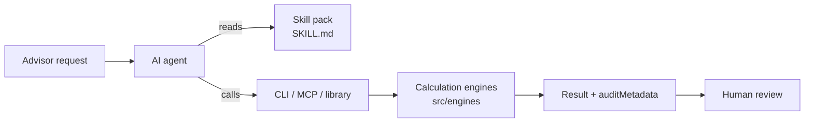

# wealth-skills

**AI skills for US wealth management.** wealth-skills gives AI agents such as Claude Code, Codex and Cursor the workflow knowledge and calculation tools to help advisors with financial planning, portfolios, trading, client onboarding, compliance, CRM, research and family-office work, with guardrails built in for a regulated industry.

It has three parts that work together:

- **Skill packs** (`skills/*/SKILL.md`) tell an agent when a pack applies, which calculations it can run, which topics are guidance only, and which limits it must state to the user.
- **Calculation engines** (`src/engines/`) do the math: tax bracket headroom, RMDs, rebalancing, Value at Risk, tax-loss harvesting, backtests, order payloads and more. They have no dependencies and run offline.
- **Interfaces** connect agents to the engines: a CLI, two MCP servers, a JavaScript library import, and a browser dashboard for people.

> [!IMPORTANT]
> **v0.1.0 — not production software.** wealth-skills prepares analysis and payloads for a licensed professional to review. It does not connect to custodians, brokers, CRMs or regulatory registries, and it never submits orders or moves money.

## How it works



Worked examples, from one-command answers to whole engagements, are in [Journeys](#journeys) below.

## Talking to it

The engines answer questions, but a conversation needs two more things: knowing what to ask when something is missing, and knowing what to do next. Every CLI and MCP result carries both.

```jsonc
{
  "cipPassed": false,
  "needsInput": [
    {
      "field": "ofacStatus",
      "question": "Has an OFAC/SDN screen been run for this applicant, and what was the result?",
      "why": "CIP cannot pass without a result from a real screening source."
    }
  ],
  "suggestedNextSteps": [
    { "tool": null, "action": "Collect the missing items above, then re-run the check", "why": "The application is not yet complete." }
  ]
}
```

So an agent asks the advisor instead of inventing a screening result, and offers the next move ("rebalancing will realize gains, scan for harvestable losses first") instead of waiting to be asked. Errors carry `needsInput` too, which turns a refusal to guess into a question: an Interactive Brokers order without a `conid` comes back asking for one.

`node bin/wealth-skills.js capabilities` lists every tool with its summary, required inputs and the phrasings it answers, so an agent can route a request without reading all eight packs.

## Journeys

Grouped by how much work the request implies. Every figure below is real output from the command shown; simulations take `--seed` so they reproduce.

| Tier | Count | Shape |
|---|---|---|
| **Simple** | 6 | One command, one answer |
| **Medium** | 8 | Two or three commands, usually with a question back to the advisor in the middle |
| **Complex** | 3 | A whole engagement across several packs, ending in several human handoffs |

---

### Simple

**"How much could this portfolio lose in a bad day?"**

```bash
node bin/wealth-skills.js portfolio var --value 5000000 --vol 0.16 --confidence 0.99
```

$117,237 at 99% confidence, 2.34% of the portfolio, with an expected shortfall of $134,314 in the tail beyond it.

**"What did a 60/40 actually do over the last decade?"**

```bash
node bin/wealth-skills.js quant backtest --weights '{"VTI":0.6,"BND":0.4}'
```

8.18% a year with 11.9% volatility and a 16.9% drawdown across 2015-2024, ending at $219,579 on $100,000.

**"How is this private equity fund tracking?"**

```bash
node bin/wealth-skills.js uhnw pe-metrics --commitment 5000000 --called 3000000 --distributions 1200000 --nav 3200000
```

1.47x TVPI and 0.4x DPI, still in the investment phase, with $2,000,000 of the commitment yet to be called.

**"What is AAPL trading at on these numbers?"**

```bash
node bin/wealth-skills.js research tear-sheet --ticker AAPL --financials '{"marketCap":3.25e12,"price":215,"eps":7.3,"revenue":3.8e11,"netIncome":1e11,"freeCashFlow":1.08e11,"dividends":1.18}'
```

P/E 29.45, P/S 8.55, a 0.55% dividend yield and 108% free cash flow conversion.

**"Turn these meeting notes into follow-ups."**

```bash
node bin/wealth-skills.js crm parse-transcript --text "Client agreed to move to the 60/40 model.
Advisor will send the proposal next week.
Operations will open the trust account."
```

One decision and two action items, due in seven and three days. The result reminds the agent to read them against the transcript first, because keyword matching misses follow-ups phrased differently.

**"Is this adviser registered?"**

```bash
node bin/wealth-skills.js compliance lookup --crd 7712345
```

Not in the bundled fixture, and the answer says exactly that rather than implying the CRD does not exist. It points to [BrokerCheck](https://brokercheck.finra.org), because this lookup is sample data.

---

### Medium

#### 1. "How much can they convert to a Roth this year?"

```bash
node bin/wealth-skills.js planning tax-headroom --agi 210000 --status MFJ
```

$33,600 of room below the $211,400 top of the 22% bracket. The result suggests checking the RMD first, because from age 73 it has to come out before a conversion and it consumes the same headroom:

```bash
node bin/wealth-skills.js planning rmd --age 75 --balance 500000
```

$20,325, on a distribution period of 24.6. If that income is not already in the AGI, roughly $13,275 of conversion room is left. The agent reports the range and says what the figure ignores - state tax, NIIT and IRMAA - for the tax preparer to confirm.

#### 2. "They're eight points overweight equities. Rebalance them."

```bash
node bin/wealth-skills.js portfolio drift-monitor --current '{"equity":68,"fixedIncome":32}' --target '{"equity":60,"fixedIncome":40}' --value 1000000 --band 5
```

Breached, urgency 80: sell $80,000 of equity, buy $80,000 of fixed income. Before trading, the result suggests looking for losses to offset the gains those sells would realize:

```bash
node bin/wealth-skills.js portfolio tlh --lots '[{"id":"L1","symbol":"VOO","quantity":100,"purchasePrice":500,"currentPrice":420,"purchaseDate":"2025-02-03"}]'
```

An $8,000 loss on VOO, with VV as a candidate replacement because it tracks a different index (CRSP US Large Cap rather than the S&P 500). Two warnings ride along: only the 30 days *before* the sale were checked, and whether a replacement is "substantially identical" is a human call. Then the trade is checked and built:

```bash
node bin/wealth-skills.js execution validate --order '{"symbol":"VOO","action":"SELL","quantity":100,"price":420}' --positions '{"VOO":100}'
node bin/wealth-skills.js execution payload --broker Alpaca --account ACC-123 --order '{"symbol":"VOO","action":"SELL","quantity":100,"price":420}'
```

The payload comes back with `requiresHumanApproval: true`. The advisor submits it in their own system; nothing here does.

#### 3. "Can they retire on $1.25M if they spend $50,000 a year?"

```bash
node bin/wealth-skills.js planning monte-carlo --assets 1250000 --spend 50000 --seed 42
```

68.1% of paths last 30 years, median ending balance $875,459 - and the tenth percentile is $0, so the bad paths do not merely end small, they run out. Drop the draw to $40,000:

```bash
node bin/wealth-skills.js planning monte-carlo --assets 1250000 --spend 40000 --seed 42
```

88.6%, median $1,841,413. Both results carry the same suggestion: agree the return, volatility and 2.5% inflation assumptions with the advisor before presenting either number, because the withdrawal drives the outcome more than the returns do.

#### 4. "What is this portfolio actually made of?"

```bash
node bin/wealth-skills.js portfolio factors --holdings '[{"symbol":"VTI","weightPct":45},{"symbol":"VXUS","weightPct":20},{"symbol":"BND","weightPct":25},{"symbol":"PRIVATE-RE","weightPct":10}]'
```

65% equity and 25% fixed income - with 10% sitting in `unclassified`, because `PRIVATE-RE` is not a symbol the library knows. Duration comes back `null` rather than invented, and three questions come with it: what asset class the private holding is, what the bond duration is, and whether a risk system can supply factor scores. Answer the first two:

```bash
node bin/wealth-skills.js portfolio factors --holdings '[{"symbol":"VTI","weightPct":45},{"symbol":"VXUS","weightPct":20},{"symbol":"BND","weightPct":25,"durationYears":6.1,"creditQuality":"AA"},{"symbol":"PRIVATE-RE","weightPct":10,"assetClass":"realAssets"}]'
```

Now 10% real assets, 6.1 years of duration at AA. Factor scores stay `null` and stay asked-for, which is the point: nothing is filled in on the portfolio's behalf.

#### 5. "What happens to this allocation if stagflation returns?"

```bash
node bin/wealth-skills.js quant forward-test --weights '{"VTI":0.6,"BND":0.4}' --regime stagflation --seed 7
node bin/wealth-skills.js quant forward-test --weights '{"VTI":0.6,"BND":0.4}' --regime baseline --seed 7
```

Under stagflation the same 60/40 carries a 0.8% expected return at 14.67% volatility, and only a 46.2% chance of being worth more in five years - against 5.8% and 84.4% in the baseline. Both results label the assumptions illustrative and tell the agent to substitute the firm's own capital market assumptions before any of it reaches a client.

#### 6. "Can we open this account?"

```bash
node bin/wealth-skills.js onboarding validate-cip --applicant '{"name":"Jane Doe","ssn":"123-45-6789","dob":"1990-05-15","address":"456 Elm St"}'
```

CIP fails with `ofacStatus: "NOT_SCREENED"` and one question: *"Has an OFAC/SDN screen been run for this applicant, and what was the result?"* The agent asks instead of assuming, because the library screens nothing. Once the firm's AML system returns a result, re-run with `"ofacStatus":"CLEAR"` and CIP passes, leaving the W-9, custodial agreement and funding to go.

#### 7. "Hedge this concentrated AAPL position without selling it."

```bash
node bin/wealth-skills.js uhnw collar --symbol AAPL --shares 100000 --price 215 --basis 25
```

A floor at $193.50 and a cap at $247.25, a 25% band - and `zeroCostStructure: null`, with a question asking for the put and call premiums, because the engine prices no options. With live quotes:

```bash
node bin/wealth-skills.js uhnw collar --symbol AAPL --shares 100000 --price 215 --basis 25 --put-premium 6.40 --call-premium 6.35
```

Now it is zero-cost within a nickel a share (a $0.05 net debit), with an effective floor of $193.45. Constructive-sale review under IRC §1259 is flagged every time; tax counsel signs off before anything is executed.

#### 8. "Can we send this to clients?"

```bash
node bin/wealth-skills.js compliance scan --text "Our managed account delivers a guaranteed 8% return every year."
```

A violation: "guaranteed 8%" is flagged and all three standard disclosures are missing. After a rewrite:

```bash
node bin/wealth-skills.js compliance scan --text "Our managed account seeks long-term growth. Past performance is no guarantee of future results. Investments are subject to market risk and may lose value."
```

It passes the automated screen - and says plainly that passing is not Rule 2210 approval, suggesting a registered principal review it. If the note quotes a company, build the numbers with `research tear-sheet` first; that result suggests scanning the wording before it goes out.

---

### Complex

#### A. The annual review

Preparing the yearly meeting for a $2.4M household: progress, allocation, risk, tax, then documentation.

```bash
node bin/wealth-skills.js portfolio drift-monitor --current '{"equity":71,"fixedIncome":24,"cash":5}' --target '{"equity":60,"fixedIncome":35,"cash":5}' --value 2400000 --band 5
node bin/wealth-skills.js portfolio var --value 2400000 --vol 0.13 --confidence 0.95
node bin/wealth-skills.js portfolio tlh --lots '[{"id":"L1","symbol":"VXUS","quantity":4000,"purchasePrice":62,"currentPrice":55,"purchaseDate":"2025-03-11"},{"id":"L2","symbol":"QQQ","quantity":300,"purchasePrice":500,"currentPrice":430,"purchaseDate":"2025-06-02"}]'
node bin/wealth-skills.js execution validate --order '{"symbol":"VXUS","action":"SELL","quantity":4000,"price":55}' --positions '{"VXUS":4000}'
```

1. **Allocation** - equities sit 11 points above target, urgency 100: sell $264,000 of equity, buy $264,000 of fixed income.
2. **Risk** - $32,328 of one-day VaR at 95%, 1.35% of the portfolio, with $40,541 expected in the tail beyond it.
3. **Tax** - $49,000 of harvestable losses. QQQ's $21,000 gets VUG, which tracks a different index; VXUS's $28,000 has no defined replacement, so the result asks which fund to use rather than guessing one.
4. **Trades** - the $220,000 VXUS sell passes against the held position.

Then the client-facing half:

```bash
node bin/wealth-skills.js compliance scan --text "Your portfolio drifted 11 points above the equity target this year. We propose trimming equities back to 60%. Past performance is no guarantee of future results. Investments are subject to market risk and may lose value."
node bin/wealth-skills.js crm parse-transcript --text "Client agreed to trim equities back to the 60/40 target.
Advisor will send the rebalance proposal next week.
Operations will process the harvest trades."
```

The review letter passes the screen and still needs a principal. The meeting notes become one decision and two follow-ups. Everything touching the account stops at the advisor: the trades carry `requiresHumanApproval: true`, and both the VXUS replacement and the "substantially identical" judgment are theirs.

#### B. The year-end sweep

A client turning 76 with an $850,000 IRA and $180,000 of AGI, filing jointly. Done in October, not the last week of December, because the distribution needs processing time.

```bash
node bin/wealth-skills.js planning rmd --age 76 --balance 850000
node bin/wealth-skills.js planning tax-headroom --agi 180000 --status MFJ
node bin/wealth-skills.js planning tax-headroom --agi 215865 --status MFJ
```

1. **The distribution** - $35,865 on a 23.7 factor, about $2,989 a month. It has to be out by December 31; the shortfall otherwise carries a 25% excise tax.
2. **The room, before it** - $63,600 below the 22% ceiling.
3. **The room, after it** - adding the distribution to income leaves $27,735. That, not $63,600, is the conversion actually available this year, and the RMD has to come out first.

Then losses to set against gains, and the note that goes with them:

```bash
node bin/wealth-skills.js portfolio tlh --lots '[{"id":"Y1","symbol":"IWM","quantity":500,"purchasePrice":230,"currentPrice":196,"purchaseDate":"2025-01-15"}]'
node bin/wealth-skills.js compliance scan --text "Before year end we plan to take your required distribution and harvest losses where available. Past performance is no guarantee of future results. Investments are subject to market risk and may lose value."
```

A $17,000 loss on IWM, replaceable with VB. The engine checked only the 30 days before the sale, so the advisor confirms nothing substantially identical gets bought in the 30 days after - including in an IRA or a spouse's account, which this library cannot see.

#### C. A $5M household transferring from another firm

Onboarding, a look at what actually transferred, a proposal, and the transition trades.

```bash
node bin/wealth-skills.js onboarding validate-cip --applicant '{"name":"Marcus Webb","ssn":"123-45-6789","dob":"1968-02-20","address":"88 Harbor Rd"}'
node bin/wealth-skills.js portfolio factors --holdings '[{"symbol":"VOO","weightPct":52},{"symbol":"IWM","weightPct":13},{"symbol":"AGG","weightPct":20,"durationYears":6.0},{"symbol":"LEGACY-FUND","weightPct":15}]'
node bin/wealth-skills.js portfolio drift-monitor --current '{"equity":65,"fixedIncome":20,"cash":0,"unclassified":15}' --target '{"equity":60,"fixedIncome":35,"cash":5,"unclassified":0}' --value 5000000 --band 5
node bin/wealth-skills.js portfolio tlh --lots '[{"id":"T1","symbol":"IWM","quantity":2000,"purchasePrice":230,"currentPrice":196,"purchaseDate":"2025-01-15"}]'
```

1. **CIP** stops at `NOT_SCREENED` and asks whether an OFAC screen was run. Nothing proceeds until it has been.
2. **What transferred** - 65% equity, 20% fixed income, and 15% in a legacy fund the library cannot classify, so it asks instead of bucketing it as equity.
3. **Against the model** - fixed income is 15 points light and the unclassified sleeve is 15 points heavy.
4. **Transition tax** - the IWM position carries a $68,000 loss, harvestable into VB (Russell 2000 into CRSP US Small Cap), which lowers the cost of moving to the model.

Then the proposal and the trades:

```bash
node bin/wealth-skills.js quant backtest --weights '{"VTI":0.6,"VXUS":0.1,"BND":0.3}'
node bin/wealth-skills.js quant forward-test --weights '{"VTI":0.6,"VXUS":0.1,"BND":0.3}' --regime baseline --years 5 --initial 5000000 --seed 11
node bin/wealth-skills.js execution fix-payload --custodian Pershing_NetX360 --symbol IWM --side SELL --qty 2000 --price 196
```

The proposed 60/10/30 model returned 8.55% a year with a 17.18% drawdown over 2015-2024, and projects an 85.4% chance of being worth more in five years: $4.74M at the tenth percentile against a $6.49M median. The transition trades leave as FIX 35=D messages for the custodian, each tagged `requiresHumanApproval: true`, and the proposal wording is screened before the prospect sees it.


## The skill packs## The skill packs

| Pack | What agents can calculate | Guidance only |
|---|---|---|
| [`wealth-planning`](skills/wealth-planning/SKILL.md) | Roth conversion bracket headroom (tax year 2026), required minimum distributions, retirement Monte Carlo with inflation-adjusted withdrawals | Tax-return parsing, estate planning, budgeting, insurance and Social Security |
| [`wealth-portfolio`](skills/wealth-portfolio/SKILL.md) | Drift monitoring and rebalance trades, Value at Risk and expected shortfall, tax-loss harvesting screens, backtests and forward simulations, asset-class exposure | Portfolio accounting and attribution, risk models, optimization, direct indexing |
| [`wealth-execution`](skills/wealth-execution/SKILL.md) | Pre-trade checks (buying power, overselling, short-term gains), Alpaca and Interactive Brokers order payloads, FIX 4.4 orders | Custodian workflows, order routing, allocations, ACAT transfers |
| [`wealth-onboarding`](skills/wealth-onboarding/SKILL.md) | Customer Identification Program field checks, recording an OFAC screen result, onboarding milestone tracking | Sanctions screening, identity verification, KYC documents, account aggregation, e-signatures |
| [`wealth-compliance`](skills/wealth-compliance/SKILL.md) | Screening communications for promissory language and missing disclosures | Registration research on BrokerCheck and IAPD, surveillance archives, supervisory review |
| [`wealth-crm`](skills/wealth-crm/SKILL.md) | Pulling decisions and action items from meeting transcripts, CRM task payloads | Meeting briefing packs, syncing with a CRM |
| [`wealth-research`](skills/wealth-research/SKILL.md) | Valuation ratios from supplied financials, risk-factor keyword summaries, latest FRED series values, SEC EDGAR company facts | Earnings summaries, market news, macro trend analysis |
| [`wealth-uhnw`](skills/wealth-uhnw/SKILL.md) | Collars on concentrated stock with constructive-sale review, private equity multiples (TVPI, DPI, RVPI) | Exchange funds, IRR and J-curve modelling, trusts, philanthropy |

Each `SKILL.md` lists its engine functions, CLI commands and the limits an agent must state.

## Built-in guardrails

- **Nothing executes.** Trading tools build order payloads locally. Submitting them is a decision for a person, in their own systems.
- **Human approval is flagged.** Rebalances, harvesting opportunities, trade payloads and collars return `requiresHumanApproval: true`.
- **Every result is traceable.** CLI and MCP results carry `auditMetadata` naming the engine, method, data used, library version and time.
- **Missing data fails closed.** An applicant with no OFAC result fails CIP, a sell without a known position fails pre-trade checks, and an unknown ticker is rejected. The engines never guess.
- **Gaps are labelled.** Packs mark guidance-only topics, the demo registration lookup declares itself sample data, and a failed live lookup returns `null` rather than a substitute value.

See [docs/COMPLIANCE_GUIDELINES.md](docs/COMPLIANCE_GUIDELINES.md) for the rules agents must follow.

## Getting started

wealth-skills needs Node.js 20.11 or later and has nothing to install.

```bash
git clone https://github.com/ai-theories/wealth-skills.git
cd wealth-skills
npm test
node bin/wealth-skills.js help
```

### CLI

Every command prints JSON with an `auditMetadata` block. Invalid input exits with status 2 (usage) or 1 (engine error). If you leave out a command's input flags, it runs on built-in sample data and says so on stderr.

```bash
node bin/wealth-skills.js portfolio drift-monitor --current '{"equity":68,"fixedIncome":32}' --target '{"equity":60,"fixedIncome":40}' --value 1000000 --band 5
node bin/wealth-skills.js portfolio tlh --lots '[{"id":"L1","symbol":"VOO","quantity":100,"purchasePrice":500,"currentPrice":420,"purchaseDate":"2025-02-03"}]'
node bin/wealth-skills.js uhnw collar --symbol AAPL --shares 100000 --price 215 --basis 25
node bin/wealth-skills.js execution fix-payload --symbol VTI --side BUY --qty 500 --price 275.50
```

### Library

```javascript
import { calculatePortfolioVar } from './src/index.js';

const risk = calculatePortfolioVar(5000000, 0.16, 0.99, 1);
console.log(risk.valueAtRiskDollar, risk.conditionalVaR_ExpectedShortfallDollar);
```

### MCP servers

Register the calculation server with your MCP client, using the absolute path to your clone:

```json
{
  "mcpServers": {
    "wealth-skills": {
      "command": "node",
      "args": ["/absolute/path/to/wealth-skills/mcp-servers/universal-wealth-server/index.js"]
    }
  }
}
```

It provides `backtest_portfolio`, `forward_test_simulation`, `monitor_portfolio_drift`, `calculate_portfolio_var`, `calculate_tax_headroom` and `scan_finra_compliance`.

A second server, `finra-sec-lookup`, answers only from two fictitious records and exists for demos. Don't give it to an agent that could mistake it for BrokerCheck or IAPD. Setup for other platforms is in [docs/AGENT_INTEGRATION.md](docs/AGENT_INTEGRATION.md).

### Dashboard

```bash
npm run dashboard
```

Then open http://127.0.0.1:4173/ to try the planning, portfolio, backtest, collar and FIX calculators in a browser. They run the same engines as the CLI.

## What it does not do

- Connect to custodians, brokers, CRMs, identity providers, or FINRA and SEC registries. Its only live data lookups are FRED series and SEC EDGAR company facts.
- Price options, run a factor risk model, parse tax returns or screen sanctions lists.
- Backtest anything beyond four ETFs (VTI, BND, VXUS and VNQ) over annual returns for 2015–2024. Forward simulations use illustrative assumptions that you can override.
- Handle tax situations beyond 2026 federal ordinary-income brackets for married-filing-jointly and single filers taking the standard deduction.
- Check the wash-sale window after a sale or in other accounts. It looks back 30 days across the lots you supply.

## Repository layout

| Path | Contents |
|---|---|
| `skills/` | The eight skill packs |
| `src/engines/` | Calculation engines, re-exported from `src/index.js` |
| `bin/wealth-skills.js` | Command-line interface |
| `mcp-servers/` | The two MCP servers and their shared protocol layer |
| `dashboard.html` | Browser dashboard, served by `bin/serve-dashboard.js` |
| `tests/` | Test suite |
| `docs/` | Integration, compliance and formatting guides |

## Testing

| Command | What it runs |
|---|---|
| `npm test` | The full offline test suite |
| `npm run test:live` | Live FRED lookups; set `SEC_EDGAR_USER_AGENT` to your organization and contact email to include SEC EDGAR |
| `npm run proofs` | 21 documented use cases with their checks, written to [docs/EMPIRICAL_TEST_PROOFS.md](docs/EMPIRICAL_TEST_PROOFS.md) |

## Documentation

- [docs/AGENT_INTEGRATION.md](docs/AGENT_INTEGRATION.md): setting up Claude, Codex and Antigravity
- [docs/COMPLIANCE_GUIDELINES.md](docs/COMPLIANCE_GUIDELINES.md): human approval, audit trail and client disclaimer rules
- [docs/UI_TEMPLATES.md](docs/UI_TEMPLATES.md): formatting results for each agent platform
- [AGENTS.md](AGENTS.md): agent roles and tool routing
- [CATALOG_CROSSWALK.md](CATALOG_CROSSWALK.md): how the packs map to the wealth management capability catalog

## License

MIT, as declared in `package.json`.
