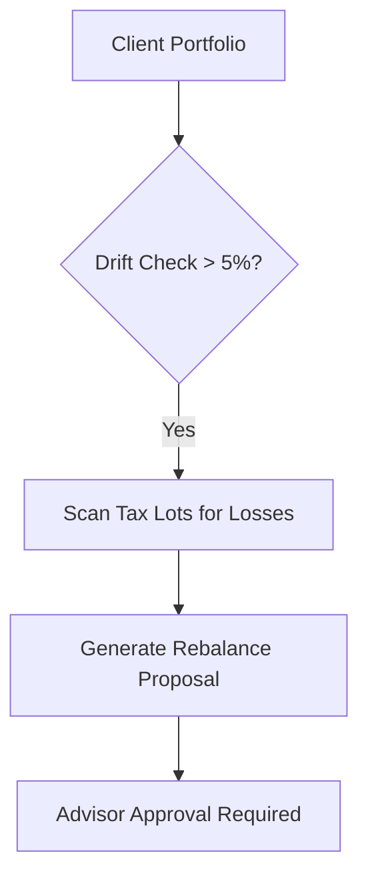

# Multi-Platform UI Template Specifications

Different AI platforms (Claude, OpenAI Codex / ChatGPT Canvas, Cursor, Google Antigravity, Devin) render markdown and interactive UI components differently. **`wealth-skills`** includes adaptive UI templates tailored to each platform.

---

## 1. Claude UI Template (Anthropic Artifacts & Rich Markdown)

### Unique Features Supported
- **GitHub Alerts**: `> [!NOTE]`, `> [!IMPORTANT]`, `> [!WARNING]`, `> [!TIP]`, `> [!CAUTION]`.
- **Mermaid Flowchart Diagrams**: Interactive workflow visualization.
- **HTML/React Artifact Cards**: Self-contained client report cards.

### Claude Format Example
```markdown
> [!IMPORTANT]
> **Advisory Action Required**: Portfolio drift breached tolerance band (8% > 5%).

### Tax-Aware Rebalance Flowchart


| Asset Class | Current % | Target % | Action |
|---|---|---|---|
| US Equities | 68% | 60% | SELL ($80,000) |
| Fixed Income | 22% | 30% | BUY ($80,000) |
```

---

## 2. OpenAI Codex & ChatGPT Canvas UI Template

### Unique Features Supported
- **LaTeX Math Rendering**: `$$...$$` block math and `\(...\)` inline math for financial formulas (Sharpe, CAGR, Monte Carlo, VaR).
- **Code Interpreter / Canvas Diffs**: Markdown tables and structured JSON schema blocks.

### Codex Format Example
```markdown
# Portfolio Return & Risk Analysis

The Sharpe ratio is computed as:
$$
\text{Sharpe Ratio} = \frac{R_p - R_f}{\sigma_p} = \frac{0.0818 - 0.03}{0.119} = 0.44
$$

### Backtest Performance (10-Year)
| Metric | Reading | Benchmark (S&P 500) |
|---|---|---|
| CAGR | 8.18% | 12.4% |
| Volatility | 11.9% | 15.2% |
| Max Drawdown | -16.9% | -24.5% |
```

---

## 3. Cursor & VS Code AI Extensions UI Template

### Unique Features Supported
- **Diff Code Blocks (`diff`)**: Visual `+`/`-` line additions and deletions for rebalance proposals.
- **Clickable File URIs**: `file:///path/to/file` links to workspace docs.

### Cursor Format Example
```markdown
### Rebalance Allocation Proposal

```diff
- US Equity: 68.0% ($680,000)
+ US Equity: 60.0% ($600,000)
- Fixed Income: 22.0% ($220,000)
+ Fixed Income: 30.0% ($30,0000)
```

For full audit records, view [COMPLIANCE_GUIDELINES.md](file:///absolute/path/to/wealth-skills/docs/COMPLIANCE_GUIDELINES.md).
```

---

## 4. Google Antigravity & Gemini UI Template

### Unique Features Supported
- **Artifact Metadata Cards**: Structured YAML/JSON metadata blocks (`audit_metadata`).
- **GitHub Alerts & GFM Tables**: Clean typography and responsive data presentation.

### Antigravity Format Example
```markdown
# Wealth Management Client Review

> [!TIP]
> Client is eligible for a **$21,050 Roth Conversion** under the 22% tax bracket ceiling.

| Parameter | Reading |
|---|---|
| Adjusted Gross Income (AGI) | $210,000 |
| Estimated Taxable Income | $180,000 |
| 22% Bracket Ceiling | $201,050 |

---
audit_metadata:
  skill_pack: "wealth-planning"
  capability_id: "T006"
  requires_human_approval: false
```

---

## 5. Using the Adaptive UI Engine in Code

```javascript
import { renderAdaptiveUI } from './src/engines/ui.js';

const reportData = {
  title: 'Portfolio Drift & Rebalance Report',
  summary: 'Equities drifted +8% above target threshold.',
  metrics: {
    'Portfolio Value': '$1,000,000',
    'Max Drift': '8.0%',
    'Urgency Score': '80 / 100'
  },
  mermaid: 'graph TD\n  A[Current] --> B[Target]'
};

// Render for Claude
const claudeMarkdown = renderAdaptiveUI(reportData, 'claude');

// Render for Codex
const codexMarkdown = renderAdaptiveUI(reportData, 'codex');
```
